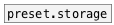
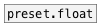
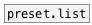

# preset.symbol

```


                    [store 0(  [store 1(
                    |          |
           [load 0( | [load 1( |
           |        | |        |
           |        | |        |
           |        | |        |
[S]    X   [preset.symbol     f1]


            
```
---
arguments:

ID: preset id (should be unique in most use
            cases)<br>
VAL: preset initial value<br>

---
properties:

@path: property OSC-like path that
            includes id, abstraction name and may be subpatch name separated by slashes.<br>
@id: preset id<br>
@init: init symbol value<br>
@global: use global path like /ID<br>
@subpatch: include subpatch name to path<br>

see also:<br>



