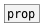

[< reference home](ceammc_lib.html)
---

# prop.declare


declare named property for subpatch or abstraction

---

<br>


---


```


[prop.declare freq @min 20 @max 20000 @default 1000]

[prop.declare gain @min -60 @max 12 @default 3]

[prop @freq] [prop @gain]
|            |
[F]          [F]

            
```

---
arguments:

NAME: property name without @ (should be unique for
            current canvas)<br>

---
properties:

@type: property type<br>
@f: alias to @type float<br>
@i: alias to @type int<br>
@b: alias to @type bool<br>
@s: alias to @type symbol<br>
@l: alias to @type list<br>
@default: default property value<br>
@min: minimal value (for float and
            int properties only)<br>
@max: maximum value (for float and
            int properties only)<br>
@enum: allowed values (without default value) (for symbol
            properties only)<br>

---
see also:<br>
[](prop.html)
[](patch.props.html)
