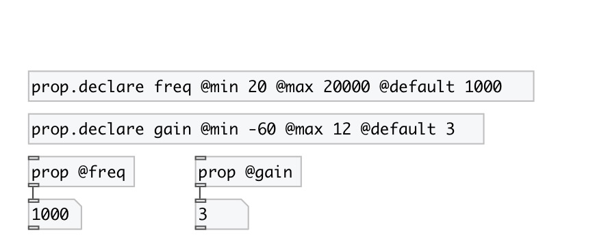

[index](index.html) :: [property](category_property.html)
---

# prop.declare

###### declare named property for subpatch or abstraction

*available since version:* 0.7

---

## arguments:

* **NAME**
property name without @ (should be unique for current canvas) 
_type:_ symbol 

## properties:

* **@type** 
Get/set property type 
_type:_ symbol 
_enum:_ float, int, bool, enum, symbol, list 
_default:_ float 

* **@f** 
Get/set alias to @type float 
_type:_ alias 

* **@i** 
Get/set alias to @type int 
_type:_ alias 

* **@b** 
Get/set alias to @type bool 
_type:_ alias 

* **@s** 
Get/set alias to @type symbol 
_type:_ alias 

* **@l** 
Get/set alias to @type list 
_type:_ alias 

* **@default** 
Get/set default property value 
_type:_ list 

* **@min** 
Get/set minimal value (for float and int properties only) 
_type:_ float 
_default:_ -inf 

* **@max** 
Get/set maximum value (for float and int properties only) 
_type:_ float 
_default:_ +inf 

* **@enum** 
Get/set allowed values (without default value) (for symbol properties only) 
_type:_ list 

## keywords:

[property](keywords/property.html)
[declare](keywords/declare.html)

**See also:**
[\[prop\]](prop.html)
[\[patch.props\]](patch.props.html)

**Authors:** Serge Poltavsky

**License:** GPL3 or later

