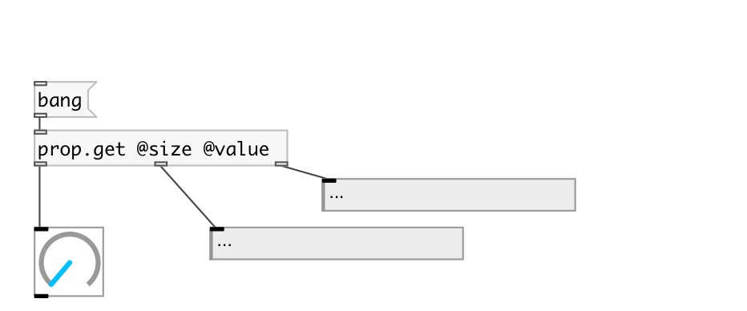

[< reference home](index.html)
---

# prop.get

Property extractor

---

Extracts properties from data stream with matching. Non property values are passed
            untouched.
 

---

---
arguments:

---
properties:

---
see also: 

