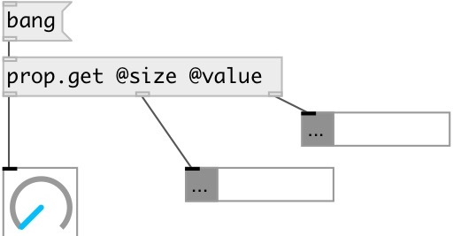

[index](index.html) :: [property](category_property.html)
---

# prop.get
**aliases:** [p.get]

###### get property from connected object/subpatch/abstraction

*available since version:* 0.9

---

## information
Get properties from connected object/subpatch/abstraction

## arguments:

* **PROPS**
property names 
_type:_ list 

## inlets:

* output specified properites to corresponding outlets 
_type:_ control

## outlets:

* connected to destination object 
_type:_ control
* output of first requested property 
_type:_ control
* output of ... requested property 
_type:_ control
* output of n-th requested property 
_type:_ control

## keywords:

[property](keywords/property.html)

**See also:**
[\[prop&lt;-\]](prop%3C-.html)

**Authors:** Serge Poltavsky

**License:** GPL3 or later

