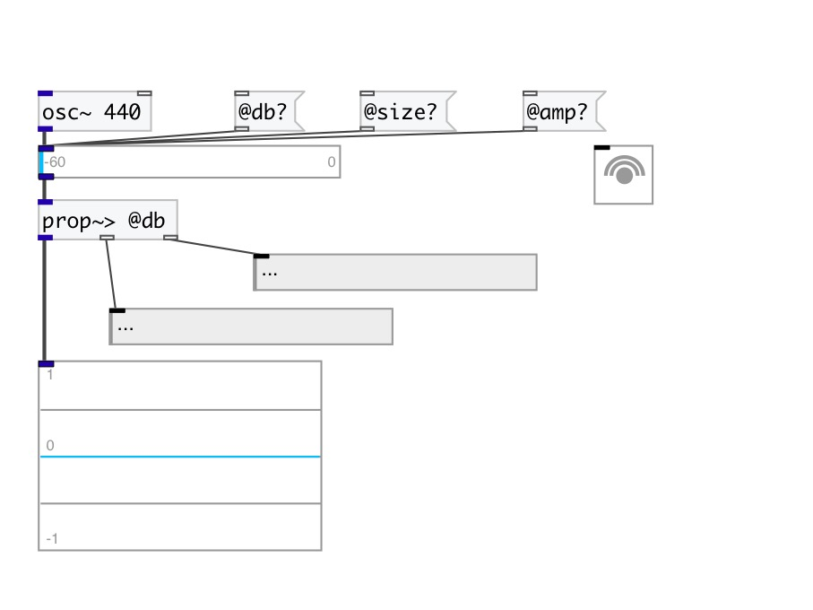

[< reference home](index.html)
---

# prop.get~

Property extractor from sound stream

---

Extracts properties from sound stream with matching. Non property values are
            passed untouched.
 

---

---
arguments:

---
properties:

---
see also: 

