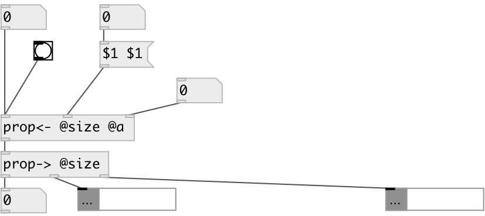

[index](index.html) :: [property](category_property.html)
---

# prop.join
**aliases:** [prop&lt;-]

###### join property to main data flow

*available since version:* 0.9

---

## information
Injects properties into data stream. Values from first inlet are passed unchanged and named property values added to stream. Note: all property inlets are *hot*, i.e. if object receives new value on inlet it immediately outputs it.

## inlets:

* data stream 
_type:_ control
* property value 
_type:_ control
* property value 
_type:_ control

## outlets:

* output values 
_type:_ control

## keywords:

[property](keywords/property.html)

**See also:**
[\[prop-&gt;\]](prop-%3E.html)

**Authors:** Serge Poltavsky

**License:** GPL3 or later

