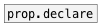

# prop

```


[prop.declare freq @min 20 @max 20000 @default 1000]

[prop.declare gain @min -60 @max 12 @default -3]

[F]
|
[prop @freq] [prop @gain]
|            |
[F]          [F]

[default(
|
[prop @freq]
|
[F]

            
```
---
arguments:

@NAME: property name<br>

---
properties:


see also:<br>


