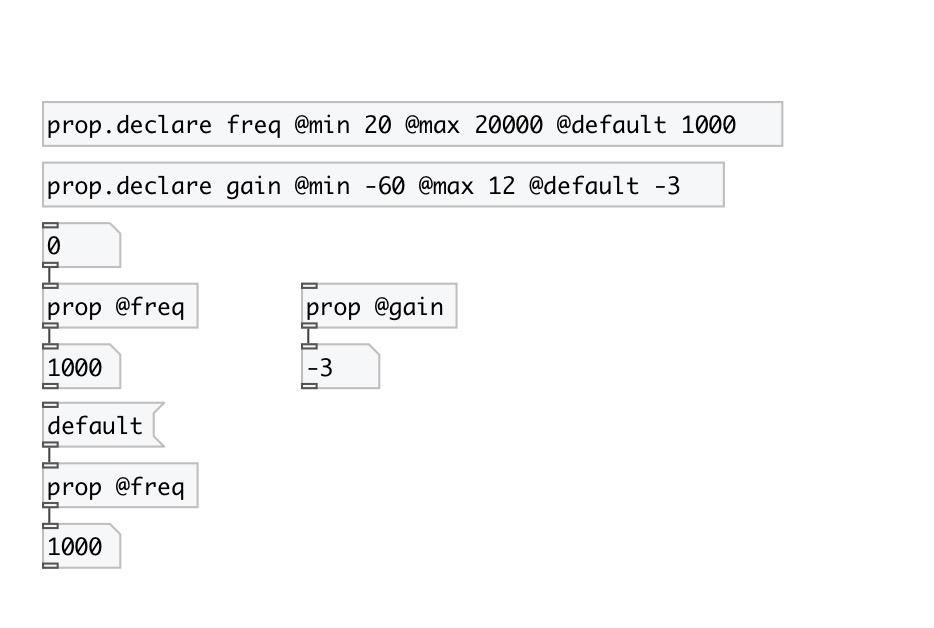

[< reference home](index.html)
---

# prop

get/set named property value for subpatch or abstraction

---

Property should be declared with [prop.declare]. Min/max limits can be set to
            property
 

---

---
arguments:

@NAME: property name 

---
properties:

---
see also: 

