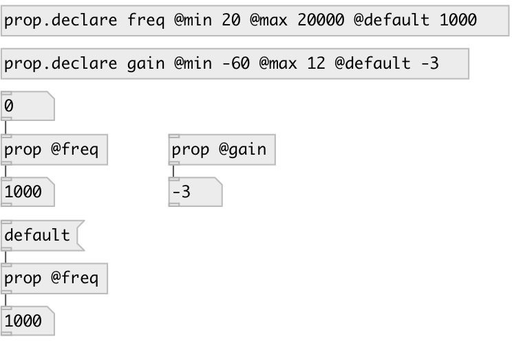

[index](index.html) :: [property](category_property.html)
---

# prop
**aliases:** [ceammc/prop]

###### get/set named property value for subpatch or abstraction

*available since version:* 0.7

---

## information
Property should be declared with [prop.declare]. Min/max limits can be set to property

## arguments:

* **@NAME**
property name 
_type:_ symbol 

## methods:

* **default**
reset to default value and output 

## inlets:

* output property value 
_type:_ control

## outlets:

* output value 
_type:_ control

## keywords:

[property](keywords/property.html)

**See also:**
[\[prop.declare\]](prop.declare.html)
[\[patch.props\]](patch.props.html)

**Authors:** Serge Poltavsky

**License:** GPL3 or later

