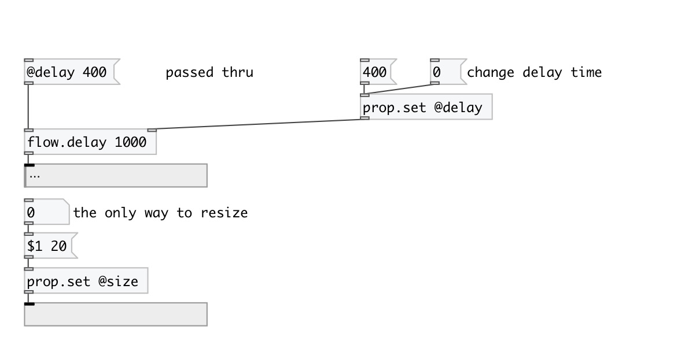

[< reference home](index.html)
---

# prop.set

Property injector

---

Injects properties into data stream. Values from first inlet are passed unchanged
            and named property values added to stream. Note: all property inlets are *hot*, i.e. if
            object receives new value on inlet it immediately outputs it.
 

---

---
arguments:

---
properties:

---
see also: 

