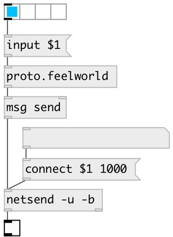

[index](index.html) :: [proto](category_proto.html)
---

# proto.feelworld

###### protocol for FeelWorld LivePro L1 HDMI mixer

*available since version:* 0.9.5

---

## methods:

* **input**
select HDMI input 
  __parameters:__
  - **N** input index 
    type: int  
    required: True  

## inlets:

* commands 
_type:_ control

## outlets:

* list: bytes to send to UDP port 1000 
_type:_ control

## keywords:

[video](keywords/video.html)
[mixer](keywords/mixer.html)
[fellworld](keywords/fellworld.html)

**Authors:** Serge Poltavsky

**License:** GPL3 or later

