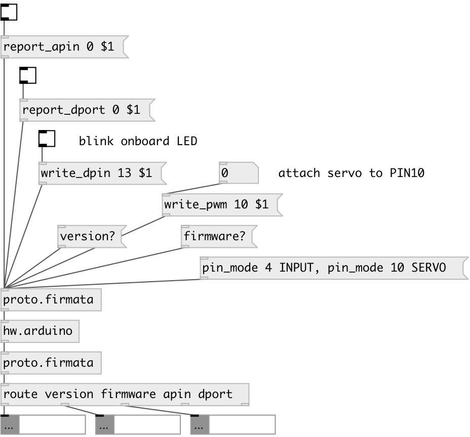

[index](index.html) :: [proto](category_proto.html)
---

# proto.firmata

###### Firmata Arduino protocol support

*available since version:* 0.5

---

## information
Firmata basic protocol support.

## methods:

* **firmware?**
query firmata protocol version. Returns message like: [firmware
ARDUINO_FIRMWARE_NAME.ino MAJOR MINOR( 

* **version?**
query firmata protocol version. Returns message like: [version MAJOR MINOR( 

* **apin_mapping?**
query mapping between analog port number and digital pin. Analog messages are
numbered 0 to 15, which traditionally refer to the Arduino pins labeled A0, A1,
A2, etc. However, these pis are actually configured using &#34;normal&#34; pin numbers
in the pin mode message, and when those pins are used for non-analog functions.
The analog mapping query provides the information about which pins (as used
with Firmata&#39;s pin mode message) correspond to the analog channels. Return
sequence of messages like: [apin_mapping A# PIN#(, where # is number 

* **capabilities?**
query pin capabilities. Return sequence of messages like: [pin_info PIN# MODE
RESOLUTION(, where # is pin number 

* **pin_state?**
query pin state. The pin state is any data written to the pin (it is important
to note that pin state != pin value). For output modes (digital output, PWM,
and Servo), the state is any value that has been previously written to the pin.
For input modes, typically the state is zero. However, for digital inputs, the
state is the status of the pull-up resistor which is 1 if enabled, 0 if
disabled. Returns message like [pin_state PIN# MODE state(, where # is pin
number 
  __parameters:__
  - **PIN#** pin number 
    type: int  
    required: True  

* **samp_interval**
sets sampling interval - how often analog data and i2c data is reported to the
client. The default for the arduino implementation is 19ms. This means that
every 19ms analog data will be reported and any i2c devices with read
continuous mode will be read. 
  __parameters:__
  - **TIME** time 
    type: int  
    units: ms  
    required: True  

* **pin_mode**
sets pin mode. 
  __parameters:__
  - **PIN#** pin number 
    type: int  
    required: True  

  - **MODE** pin mode 
    type: symbol  
    required: True  

* **write_dpin**
write 1 or 0 to digital pin. Pin mode should be OUTPUT. 
  __parameters:__
  - **PIN#** pin number 
    type: int  
    required: True  

  - **VALUE** pin value 
    type: int  
    required: True  

* **write_pwm**
writes PWM (Pulse Width Modulation) value to specified pin. 
  __parameters:__
  - **PIN#** pin number 
    type: int  
    required: True  

  - **VALUE** pin value 
    type: int  
    required: True  

* **report_apin**
turns on/off analog pin (A0-A6) value reporting. 
  __parameters:__
  - **ANALOG_PIN** analog pin number 
    type: int  
    required: True  

  - **VALUE** value. If 1 - activates analog reporting, messages like [apin PIN# value( are returned every sampling interval (by default 19ms) 
    type: int  
    required: True  

* **report_dport**
turns on/off digital port value reporting. 
  __parameters:__
  - **PORT#** digital port number. Port is a group of pins, port 0 refers pins 0-8 
    type: int  
    required: True  

  - **VALUE** value. If 1 - activates digital port reporting, messages like [dport PORT# value( are returned only on pin value change 
    type: int  
    required: True  

## inlets:

* raw input of bytes from Arduino serial connection 
_type:_ control

## outlets:

* raw byte output to Arduino serial connection and tagged parsed output from Arduino 
_type:_ control

## keywords:

[arduino](keywords/arduino.html)
[firmata](keywords/firmata.html)

**Authors:** Serge Poltavsky

**License:** GPL3 or later

