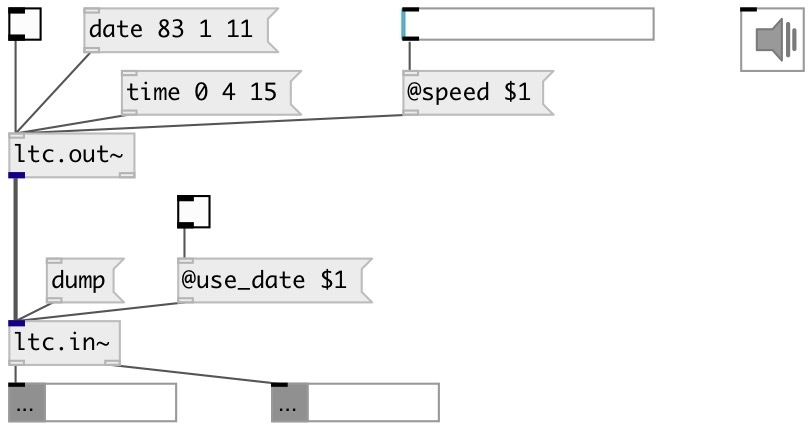

[index](index.html) :: [proto](category_proto.html)
---

# proto.ltc.in~
**aliases:** [ltc.in\~]

###### LTC decoder

*available since version:* 0.9.7

---

## properties:

* **@use_date** 
Get/set decode date 
_type:_ bool 
_default:_ 1 

* **@volume** (readonly)
Get input signal level 
_type:_ float 
_units:_ db 
_range:_ -60..0 
_default:_ 0 

* **@fps** (readonly)
Get current fpt rate 
_type:_ int 
_default:_ 25 

## inlets:

* input signal 
_type:_ audio

## outlets:

* list: HOUR MINUTE SECOND FRAME 
_type:_ control
* list: YEAR MONTH DAY 
_type:_ control

## keywords:

[parser](keywords/parser.html)
[ltc](keywords/ltc.html)

**See also:**
[\[ltc.out~\]](ltc.out~.html)

**Authors:** Serge Poltavsky

**License:** GPL3 or later

