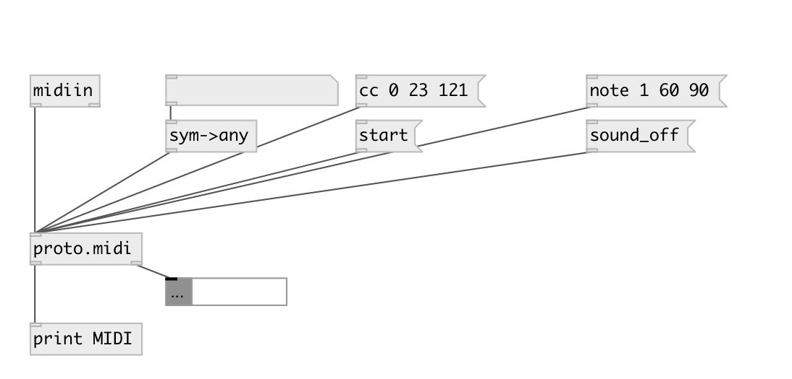

[index](index.html) :: [proto](category_proto.html)
---

# proto.midi

###### raw midi encoder/parser

*available since version:* 0.9.2

---

## methods:

* **note**
alias to [noteon( 

* **noteon**
send Note On message 
  __parameters:__
  - **CH** midi channel 
    type: int  
    required: True  

  - **NOTE** midi note 
    type: int  
    required: True  

  - **VEL** velocity 
    type: int  
    required: True  

* **noteoff**
send Note Off message 
  __parameters:__
  - **CH** midi channel 
    type: int  
    required: True  

  - **NOTE** midi note 
    type: int  
    required: True  

  - **VEL** velocity 
    type: int  
    required: True  

* **cc**
send Control Change message 
  __parameters:__
  - **CH** midi channel 
    type: int  
    required: True  

  - **CTL** control number 
    type: int  
    required: True  

  - **VAL** control value 
    type: int  
    required: True  

* **program**
send Program Change message 
  __parameters:__
  - **CH** midi channel 
    type: int  
    required: True  

  - **N** program number 
    type: int  
    required: True  

* **aftertouch**
send After Touch (Mono) message 
  __parameters:__
  - **CH** midi channel 
    type: int  
    required: True  

  - **VEL** velocity 
    type: int  
    required: True  

* **polytouch**
send After Touch (Poly) message 
  __parameters:__
  - **CH** midi channel 
    type: int  
    required: True  

  - **NOTE** midi note 
    type: int  
    required: True  

  - **VEL** velocity 
    type: int  
    required: True  

* **pitchwheel**
send Pitch Wheel message 
  __parameters:__
  - **CH** midi channel 
    type: int  
    required: True  

  - **VAL** value 
    type: int  
    required: True  

* **sysex**
send SysEx message (0xF0) 
  __parameters:__
  - **BYTES** sysex message body 
    type: list  
    required: True  

* **timecode**
send midi timecode as series of MTC quarter frame messages (0xF1) 
  __parameters:__
  - **TIME** time value. Various formats can be used: 100sec, 1h, 20.5min or 01:12:34.11. 
    type: atom  
    required: True  

  - **FPS** framerate 
    type: float  
    required: True  

* **songpos**
send Song Position Pointer message (0xF2) 
  __parameters:__
  - **IDX** position 
    type: int  
    required: True  

  - **[DUR=16]** position duration. By default is sixteen note. 
    type: int  

* **songsel**
send Song Select message (0xF3) 
  __parameters:__
  - **IDX** song index 
    type: int  
    required: True  

* **tunerequest**
send Tune Request message (0xF6) 

* **clock**
send Timing Clock realtime message (0xF8) 

* **tick**
send Timing Tick realtime message (0xF9) 

* **start**
send Start realtime message (0xFA) 

* **stop**
send Stop realtime message (0xFC) 

* **continue**
send Continue realtime message (0xFB) 

* **activesense**
send Active Sense realtime message (0xFE) 

* **sysreset**
send System Reset realtime message (0xFF) 

## inlets:

* raw midi input bytes 
_type:_ control

## outlets:

* float: raw midi output or parsed messages with selector (output format same as for corresponding methods) 
_type:_ control

## keywords:

[parser](keywords/parser.html)
[midi](keywords/midi.html)

**Authors:** Serge Poltavsky

**License:** GPL3 or later

