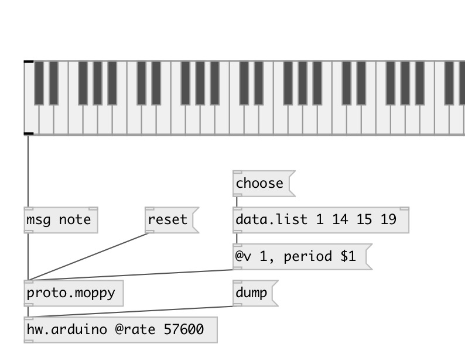

[index](index.html) :: [proto](category_proto.html)
---

# proto.moppy

###### protocol for Musical flOPPY controller

*available since version:* 0.9.5

---

## methods:

* **bend:f**
note pitchbend 
  __parameters:__
  - **VAL** pitch bend 
    type: float  
    required: True  

* **freq**
set floppy frequency. Note: moppy.v1 version only. 
  __parameters:__
  - **[CHAN]** optional floppy id (overrides @floppy property) 
    type: int  

  - **FREQ** freq 
    type: float  
    units: Hz  
    required: True  

* **note**
see noteon 

* **noteoff**
note off message 
  __parameters:__
  - **[CHAN]** optional floppy id (overrides @floppy property) 
    type: int  

  - **NOTE** MIDI note 
    type: int  
    required: True  

* **noteon**
play note 
  __parameters:__
  - **[CHAN]** optional floppy id (overrides @floppy property) 
    type: int  

  - **NOTE** MIDI note 
    type: int  
    required: True  

  - **VEL** note velocity (if 0 - turns note off, otherwise ignored) 
    type: int  
    required: True  

* **period**
directly set floppy drive period. Note: moppy.v1 version only. 
  __parameters:__
  - **[CHAN]** optional floppy id (overrides @floppy property) 
    type: int  

  - **TIME** period in microseconds 
    type: int  
    required: True  

* **ping**
send ping request to all devices 

* **reset**
reset moppy device. 
  __parameters:__
  - **[all]** reset all devices 
    type: symbol  

## properties:

* **@v** 
Get/set MOPPY protocol version 
_type:_ int 
_enum:_ 2, 1 
_default:_ 2 

* **@device** 
Get/set moppy device ID 
_type:_ int 
_range:_ 1..255 
_default:_ 1 

* **@floppy** 
Get/set floppy ID on moppy device 
_type:_ int 
_range:_ 1..16 
_default:_ 1 

## inlets:

* commands 
_type:_ control

## outlets:

* list: output to moppy 
_type:_ control

## keywords:

[floppy](keywords/floppy.html)
[diy](keywords/diy.html)
[serial](keywords/serial.html)

**Authors:** Serge Poltavsky

**License:** GPL3 or later

