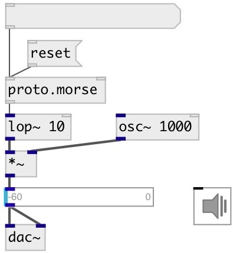

[index](index.html) :: [proto](category_proto.html)
---

# proto.morse

###### Morse encoder

*available since version:* 0.9.7

---

## arguments:

* **DOT**
dot length 
_type:_ float 
_units:_ ms 

## methods:

* **reset**
reset encoder 

## properties:

* **@dot** 
Get/set dot length 
_type:_ float 
_units:_ ms 
_range:_ 5..1000 
_default:_ 100 

* **@letter** 
Get/set space between letters in dot units 
_type:_ int 
_range:_ 2..20 
_default:_ 3 

* **@word** 
Get/set space between words in dot units 
_type:_ int 
_range:_ 2..20 
_default:_ 5 

* **@external** 
Get/set use external clock 
_type:_ bool 
_default:_ 0 

## inlets:

* add words to encoder 
_type:_ control
* external clock 
_type:_ control

## outlets:

* float: 1 or 0 
_type:_ control

## keywords:

[morse](keywords/morse.html)
[proto](keywords/proto.html)

**Authors:** Serge Poltavsky

**License:** GPL3 or later

