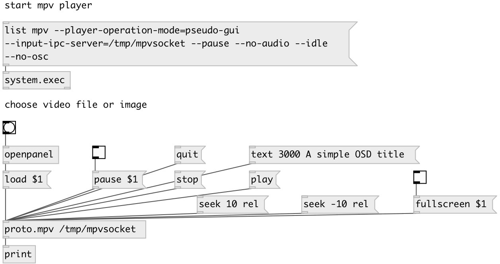

[index](index.html) :: [proto](category_proto.html)
---

# proto.mpv

###### mpv video player control

*available since version:* 0.9.3

---

## information
MPV video player control

## arguments:

* **IPC**
path to IPC local socket 
_type:_ symbol 

## methods:

* **stop**
stop playback and clear playlist. With default settings, this is essentially
like quit. Useful for the client API: playback can be stopped without
terminating the player. 
  __parameters:__
  - **[KEEP_PLIST]** if 1 - do not clear the playlist 
    type: int  

* **fullscreen**
set MPV fullscreen mode 
  __parameters:__
  - **[ON]** 1: switch to fullscreen mode, 0: switch to window mode 
    type: int  

* **pause**
resume/stop playing 
  __parameters:__
  - **[PAUSE]** 1: stop playing, 0: resume playing 
    type: int  

* **load**
load file 
  __parameters:__
  - **PATH** path to media file 
    type: symbol  
    required: True  

* **playlist**
load playlist 
  __parameters:__
  - **PATH** path to playlist file 
    type: symbol  
    required: True  

  - **[MODE]** replace: stop playback and replace the internal playlist with the new one (default). append: append the new playlist at the end of the current internal playlist 
    type: symbol  

* **next**
go to the next entry on the playlist. 
  __parameters:__
  - **[FORCE]** 0: if the last file on the playlist is currently played, do nothing. 1: terminate playback if there are no more files on the playlist 
    type: int  

* **prev**
go to the previous entry on the playlist. 
  __parameters:__
  - **[FORCE]** 0: if the first file on the playlist is currently played, do nothing. 1: terminate playback if the first file is being played. 
    type: int  

* **text**
show OSD (on screen dispaly) text. 
  __parameters:__
  - **DUR** show time in milliseconds 
    type: int  
    required: True  

  - **TXT** text 
    type: list  
    required: True  

* **quit**
exit the player 

* **play**
start play current file 

* **seek**
change the playback position. By default, seeks by a relative amount of seconds 
  __parameters:__
  - **[time]** *rel*: relative (default), seek relative to current position (a negative value seeks backwards). *abs*: absolute, seek to a given time (a negative value starts from the end of the file). *percent* or *%*: seek to a given percent position. 
    type: symbol  

## properties:

* **@ipc** 
Get/set path to IPC local socket 
_type:_ symbol 

## inlets:

* commands 
_type:_ control

## outlets:

* mpv output 
_type:_ control

## keywords:

[mpv](keywords/mpv.html)
[mplayer](keywords/mplayer.html)

**Authors:** Serge Poltavsky

**License:** GPL3 or later

