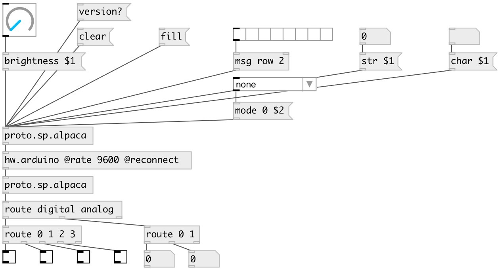

[index](index.html) :: [proto](category_proto.html)
---

# proto.sp.alpaca

###### protocol parser for Arduino-based CEAMMC footswitch

*available since version:* 0.8

---

## methods:

* **dump**
dumps all object info to Pd console window. 

* **brightness**
set LED brightness 
  __parameters:__
  - **VAL** value 
    type: float  
    required: True  

* **clear**
clear LED display 

* **fill**
fill LED display 

* **invert**
invert LED display 

* **sync**
force device to send it&#39;s button and mode state 

* **version?**
outputs device protocol version as message: [version N] 

* **mode**
set device jack mode 
  __parameters:__
  - **IDX** left (0) or right (1) device side 
    type: int  
    required: True  

  - **MODE** output mode: none - no output, digital1 - send only first button press, digital2 - send only second button press, digital - send both buttons press, analog - send analog value (from pedal), analog_row - send raw analog values (pair) 
    type: symbol  
    required: True  

* **pixel**
draw/clear pixel on display matrix (6x8). 
  __parameters:__
  - **X** x-pixel coordinate 
    type: int  
    required: True  

  - **Y** y-pixel coordinate 
    type: int  
    required: True  

  - **ON/OFF** draw (1) or clear (0) 
    type: int  
    required: True  

* **char**
draw char at specified position 
  __parameters:__
  - **CH** char symbol or int value from 0 to 9 
    type: atom  
    required: True  

  - **[XOFF]** horizontal character offset 
    type: int  

* **char**
draw char at specified position 
  __parameters:__
  - **CH** char symbol or int value from 0 to 9 
    type: atom  
    required: True  

  - **[XOFF]** horizontal character offset 
    type: int  

* **str**
draw string 
  __parameters:__
  - **STR** string or int value from -9 to 99 
    type: atom  
    required: True  

* **col**
draw column pixels 
  __parameters:__
  - **N** column index 
    type: int  
    required: True  

  - **BITS** list of 0 and 1 
    type: list  
    required: True  

* **row**
draw row pixels 
  __parameters:__
  - **N** row index 
    type: int  
    required: True  

  - **BITS** list of 0 and 1 
    type: list  
    required: True  

## inlets:

* input byte value from arduino 
_type:_ control

## outlets:

* output parsed messages from device 
_type:_ control

## keywords:

[protocol](keywords/protocol.html)
[diy](keywords/diy.html)
[alpaca](keywords/alpaca.html)
[footswitch](keywords/footswitch.html)

**Authors:** Serge Poltavsky

**License:** GPL3 or later

