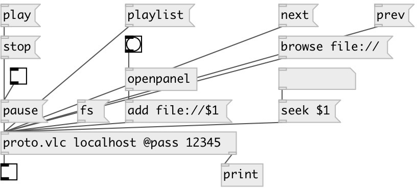

[index](index.html) :: [proto](category_proto.html)
---

# proto.vlc

###### VLC video player control over HTTP

*available since version:* 0.9.5

---

## information
VLC video player control

## arguments:

* **HOST**
hostname on that VLC player is running on 
_type:_ symbol 

## methods:

* **delete**
delete item from playlist 
  __parameters:__
  - **[ID]** playlist entry id 
    type: int  

* **fs**
toggle VLC fullscreen mode 

* **clear**
clear playlist 

* **volume**
set playing volume 
  __parameters:__
  - **VAL** absolute value in percent or relative change +VOL or -VOL 
    type: atom  
    required: True  

* **loop**
toggle loop 

* **next**
go to the next entry on the playlist 

* **prev**
go to the previous entry on the playlist 

* **seek**
seek playback position 
  __parameters:__
  - **TIME** absolute time position (int value in seconds or 00h:00m:00s) or relative offset (+val, -val) 
    type: atom  
    required: True  

* **play**
start playback 

* **stop**
stop playback 

* **pause**
pause/resume playback 
  __parameters:__
  - **[VAL]** 1 or omitted: pause, 0: resume 
    type: int  

* **add**
add URI to playlist 
  __parameters:__
  - **URI** resource URI (file:// or http:// or camera://) 
    type: symbol  
    required: True  

* **status**
request playback status. Output as dict to second outlet 

* **playlist**
request playlist. Output as dict to second outlet 

* **browse**
browse resource 
  __parameters:__
  - **URI** resource URI (file:///path) 
    type: symbol  
    required: True  

## properties:

* **@host** 
Get/set hostname on that VLC player is running on 
_type:_ symbol 
_default:_ localhost 

* **@port** 
Get/set hostname on that VLC player is running on 
_type:_ int 
_range:_ 1..32768 
_default:_ 8080 

* **@pass** 
Get/set VLC http password 
_type:_ atom 

## inlets:

* commands 
_type:_ control

## outlets:

* int: 1 on success, 0 on error 
_type:_ control
* dict: response data 
_type:_ control

## keywords:

[mpv](keywords/mpv.html)
[mplayer](keywords/mplayer.html)

**Authors:** Serge Poltavsky

**License:** GPL3 or later

