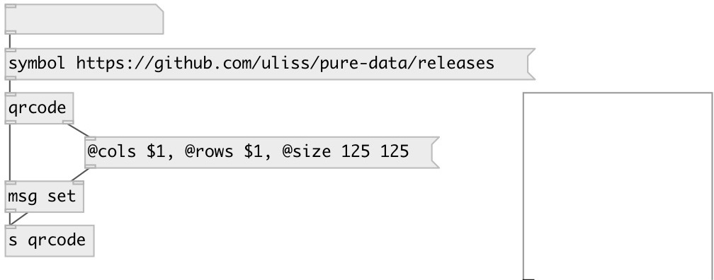

[index](index.html) :: [misc](category_misc.html)
---

# qrcode
**aliases:** [ceammc/qrcode]

###### QR code generator

*available since version:* 0.9.7

---

## arguments:

* **VALUE**
initial string value 
_type:_ symbol 

## properties:

* **@value** 
Get/set string value 
_type:_ symbol 

* **@quality** 
Get/set encoding quality 
_type:_ symbol 
_enum:_ low, medium, quartile, high 
_default:_ low 

* **@low** 
Get/set alias to @quality low 
_type:_ alias 

* **@medium** 
Get/set alias to @quality medium 
_type:_ alias 

* **@quartile** 
Get/set alias to @quality quartile 
_type:_ alias 

* **@high** 
Get/set alias to @quality high 
_type:_ alias 

## inlets:

* output encoded data 
_type:_ control

## outlets:

* list of 1 and 0 
_type:_ control
* int: qr code size 
_type:_ control

## keywords:

[qrcode](keywords/qrcode.html)

**Authors:** Serge Poltavsky

**License:** GPL3 or later

