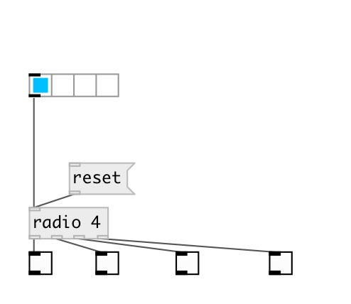

[index](index.html) :: [base](category_base.html)
---

# radio
**aliases:** [ceammc/radio]

###### float index to outlet values as radio switch

*available since version:* 0.6

---

## arguments:

* **N**
number of outlets 
_type:_ int 

## methods:

* **reset**
output zeroes to all outlets 

## properties:

* **@n** (initonly)
Get/set number of outlets 
_type:_ int 
_range:_ 2..24 
_default:_ 2 

## inlets:

* index 
_type:_ control

## outlets:

* first output 
_type:_ control
* first output 
_type:_ control

## keywords:

[radio](keywords/radio.html)

**See also:**
[\[hradio\]](hradio.html)

**Authors:** Serge Poltavsky

**License:** GPL3 or later

