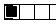

[< reference home](ceammc_lib.html)
---

# radio


float index to outlet values as radio switch

```


[ui.radio @nitems 4]
|
|
|
|  [reset(
|  |
[radio           4]
|   ^|   ^^|   ^^^|
[T]  [T]   [T]    [T]

            
```

---
arguments:

N: number of outlets<br>

---
properties:

@n: number of
            outlets<br>

---
see also:<br>
[](hradio.html)
