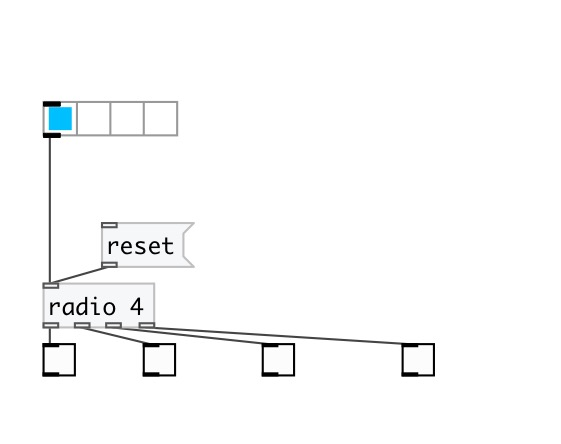

[< reference home](index.html)
---

# radio

float index to outlet values as radio switch

---

 

---

---
arguments:

N: number of outlets 

---
properties:

@n: number of
            outlets 

---
see also: 

