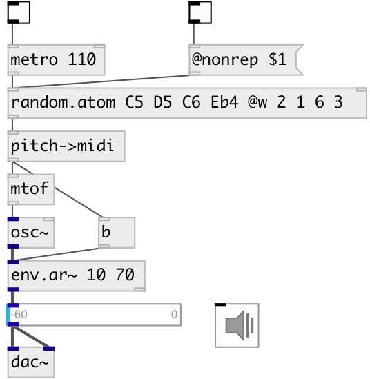

[index](index.html) :: [random](category_random.html)
---

# random.atom
**aliases:** [random.a]

###### weighted atom generation from specified list

*available since version:* 0.9.1

---

## information
Choose random atom from specified list (with weights) and output it Use @seed property to get reproducible sequences. If @seed property was not explicitly set or specified, uses generator initialized with current time.

## arguments:

* **ARG**
list of atoms 
_type:_ list 

## properties:

* **@a** 
Get/set list of atoms 
_type:_ list 

* **@w** 
Get/set list of atom weights 
_type:_ list 

* **@seed** 
Get/set generator seed 
_type:_ int 
_min value:_ 0 
_default:_ 0 

## inlets:

* output random atom 
_type:_ control

## outlets:

* random atom value 
_type:_ control

## keywords:

[random](keywords/random.html)
[atom](keywords/atom.html)

**See also:**
[\[random.float\]](random.float.html)
[\[random.gauss\]](random.gauss.html)

**Authors:** Serge Poltavsky

**License:** GPL3 or later

