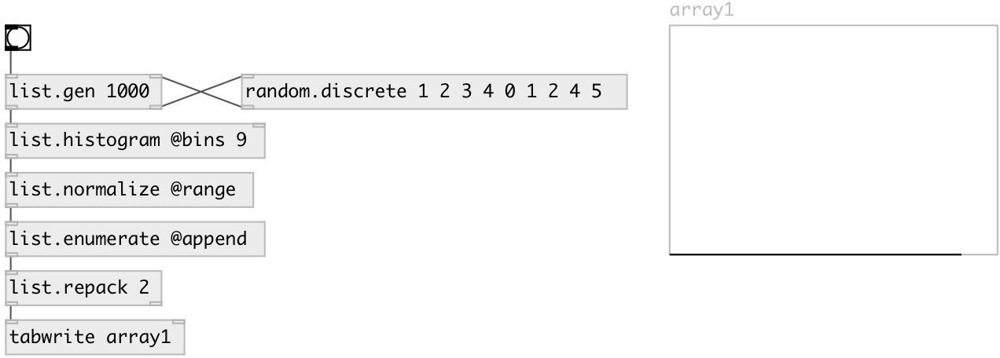

[index](index.html) :: [random](category_random.html)
---

# random.discrete

###### random weighted integers on interval [0, n)

*available since version:* 0.4

---

## information
Produces random integers on the interval [0, N), where the probability of each individual integer *i* defined as Wⁱ/S, that is the weight of the i-th integer divided by the sum of all N weights. Use @seed property to get reproducible sequences. If @seed property was not explicitly set or specified, uses generator initialized with current time.

## arguments:

* **WEIGHTS**
weights (list of non-negative floats) 
_type:_ list 

## properties:

* **@weights** 
Get/set list of weights (non-negative floats) 
_type:_ list 

* **@seed** 
Get/set generator seed 
_type:_ int 
_min value:_ 0 
_default:_ 0 

## inlets:

* generates random number in interval [0, N), where N is number of weights. 
_type:_ control

## outlets:

* result value 
_type:_ control

## keywords:

[linear](keywords/linear.html)
[random](keywords/random.html)
[discrete](keywords/discrete.html)

**See also:**
[\[random.linear\]](random.linear.html)
[\[random.pw_const\]](random.pw_const.html)

**Authors:** Serge Poltavsky

**License:** GPL3 or later

