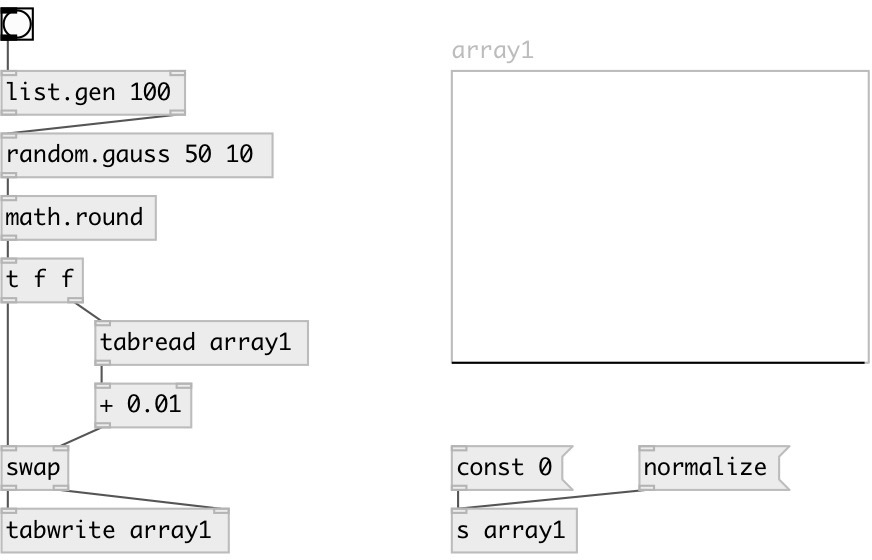

[index](index.html) :: [random](category_random.html)
---

# random.gauss

###### gaussian random distribution

*available since version:* 0.1

---

## information
Generates random value that has gaussian distribution. It has the shape of a bell
            curve and characterized by two parameters, mu and sigma.
The center of the density function, mu, is the mean of the random variable. The
            spread of the density function is measured by a parameter called *standard deviation*
            or sigma. 68.26% of all results will occur in the interval with width +-SIGMA, centered
            by the mean; the random variable is unbounded, both as above and below the mean.
99.74% of all results fall within +-3 SIGMA.
Use @seed property to get reproducible sequences. If @seed property was not
            explicitly set or specified, uses generator initialized with current time.

## arguments:

* **MU**
the mean 
__type:__ float 

* **SIGMA**
the standard deviation 
__type:__ float 

## properties:

* **@mu** 
Get/set the mean 
__type:__ float 
__default:__ 0 

* **@sigma** 
Get/set the standard deviation 
__type:__ float 
__min value:__ 0 
__default:__ 0 

* **@seed** 
Get/set generator seed 
__type:__ int 
__min value:__ 0 
__default:__ 0 

## inlets:

* generates random number 
__type:__ control 

## outlets:

* result value
__type:__ control 

## keywords:

[gauss](keywords/gauss.html)
[random](keywords/random.html)

**See also:**
[\[random.float\]](random.float.html)
[\[random.int\]](random.int.html)

**Authors:** Serge Poltavsky

**License:** GPL3 or later

