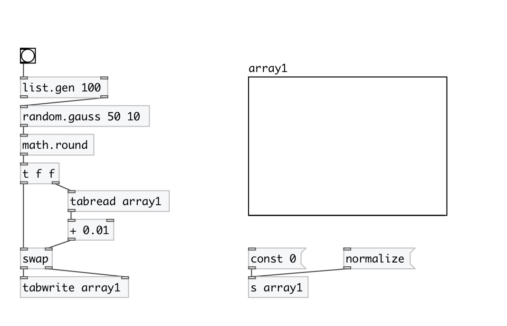

[< reference home](index.html)
---

# random.gauss

gaussian random distribution

---

Generates random value that has gaussian distribution. It has the shape of a bell
            curve and characterized by two parameters, mu and sigma.
The center of the density function, mu, is the mean of the random variable. The
            spread of the density function is measured by a parameter called *standard deviation*
            or sigma. 68.26% of all results will occur in the interval with width +-SIGMA, centered
            by the mean; the random variable is unbounded, both as above and below the mean.
99.74% of all results fall within +-3 SIGMA.
 

---

---
arguments:

MU: the mean 
SIGMA: the standard deviation 

---
properties:

@mu: the mean 
@sigma: the standard
            deviation 

---
see also: 

