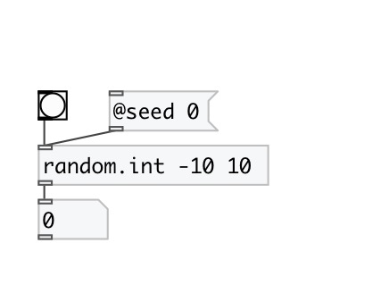

[< reference home](index.html)
---

# random.int

Random integer generator in specified range

---

Generates pseudo-random number in specified closed interval.
 

---

---
arguments:

---
properties:

---
see also: 

