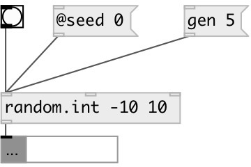

[index](index.html) :: [random](category_random.html)
---

# random.int

###### uniform random integer generator in specified range

*available since version:* 0.1

---

## information
Generates pseudo-random number in specified closed interval.
Use @seed property to get reproducible sequences. If @seed property was not
            explicitly set or specified, uses generator initialized with current time.
Algorithm: 32-bit Mersenne Twister by Matsumoto and Nishimura, 1998

## arguments:

* **ARG**
@min=ARG[0], @max=ARG[1], in case of signle arg: @min=0, @max=ARG[0] 
_type:_ list 

## methods:

* **gen**
generate list of random integers with specified length 
  __parameters:__
  - **N** list length 
    type: int  
    required: True  

## properties:

* **@min** 
Get/set random range lower bound 
_type:_ int 
_default:_ 0 

* **@max** 
Get/set random range upper bound 
_type:_ int 
_default:_ 255 

* **@seed** 
Get/set generator seed 
_type:_ int 
_min value:_ 0 
_default:_ 0 

## inlets:

* generate new number 
_type:_ control
* set @min property 
_type:_ control
* set @max property 
_type:_ control

## outlets:

* int or list: generated value 
_type:_ control

## keywords:

[random](keywords/random.html)
[int](keywords/int.html)

**See also:**
[\[random.float\]](random.float.html)
[\[random.gauss\]](random.gauss.html)

**Authors:** Serge Poltavsky

**License:** GPL3 or later

