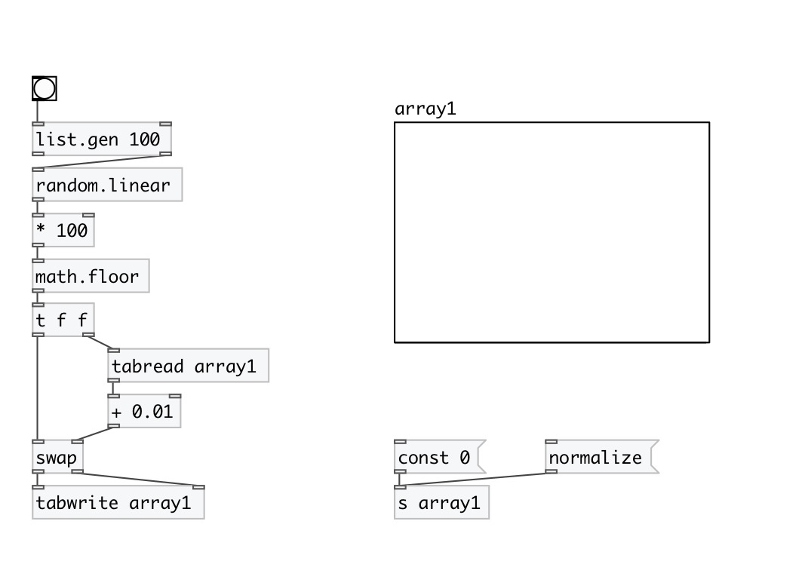

[< reference home](index.html)
---

# random.linear

random linear distribution

---

Generates random number in interval [@v0, @v1) with linear distribution [@p0,
            @p1)
 

---

---
arguments:

---
properties:

@v0: begin of value interval 
@v1: end of value interval 
@p0: probability at begin 
@p1: probability at end 

---
see also: 

