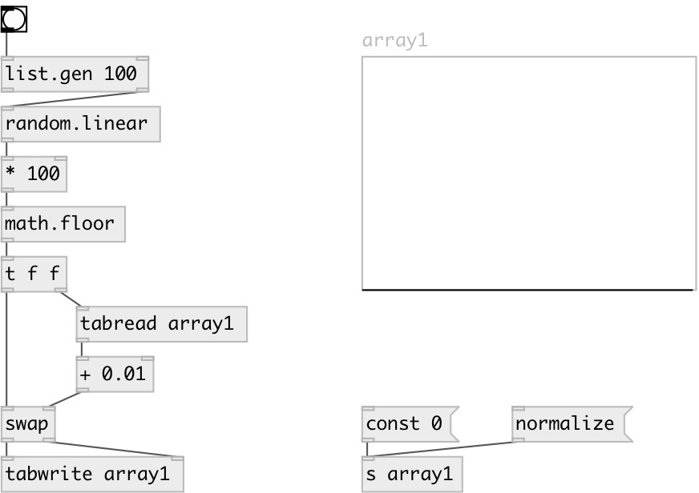

[index](index.html) :: [random](category_random.html)
---

# random.linear

###### random linear distribution

*available since version:* 0.4

---

## information
Generates random number in interval [@v0, @v1) with linear distribution [@p0, @p1) Use @seed property to get reproducible sequences. If @seed property was not explicitly set or specified, uses generator initialized with current time.

## properties:

* **@v0** 
Get/set begin of value interval 
_type:_ float 
_default:_ 0 

* **@v1** 
Get/set end of value interval 
_type:_ float 
_default:_ 1 

* **@p0** 
Get/set probability at begin 
_type:_ float 
_default:_ 1 

* **@p1** 
Get/set probability at end 
_type:_ float 
_default:_ 0 

* **@seed** 
Get/set generator seed 
_type:_ int 
_min value:_ 0 
_default:_ 0 

## inlets:

* generates random number 
_type:_ control

## outlets:

* result value 
_type:_ control

## keywords:

[linear](keywords/linear.html)
[random](keywords/random.html)

**See also:**
[\[random.float\]](random.float.html)
[\[random.int\]](random.int.html)

**Authors:** Serge Poltavsky

**License:** GPL3 or later

