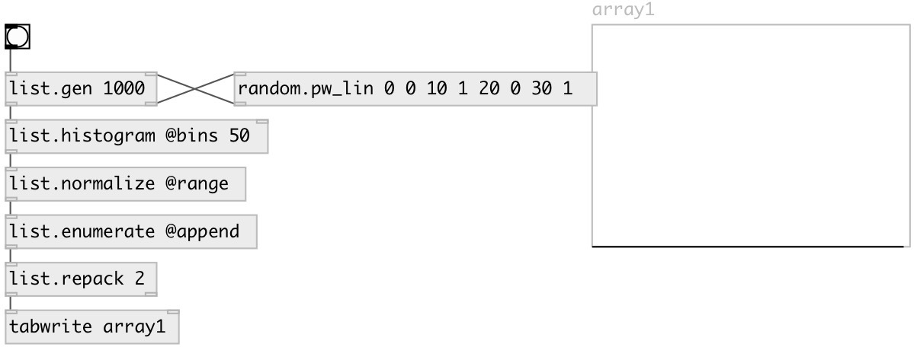

[index](index.html) :: [random](category_random.html)
---

# random.pw_lin

###### piecewise linear random distribution

*available since version:* 0.4

---

## information
Produces random floating-point numbers, which are distributed according to a linear probability density function within each of the several subintervals [b0, b1) Linear segments specified as: bound0, prob0, bound1, prob1, etc Use @seed property to get reproducible sequences. If @seed property was not explicitly set or specified, uses generator initialized with current time.

## arguments:

* **V**
interleaved interval boundaries and boundary propabilities. Note: number of
arguments should be even and &gt;=4. Boundaries should be in strictly increasing
order and weights should be non-negative 
_type:_ list 

## properties:

* **@v** 
Get/set interleaved interval boundaries and boundary propabilities. For example: values
0 0 0.5 0 1 0 produce triangle distribution 
_type:_ list 

* **@bounds** (readonly)
Get list of boundaries 
_type:_ list 

* **@weights** (readonly)
Get list of weights 
_type:_ list 

* **@seed** 
Get/set generator seed 
_type:_ int 
_min value:_ 0 
_default:_ 0 

## inlets:

* generates random number 
_type:_ control

## outlets:

* result value 
_type:_ control

## keywords:

[linear](keywords/linear.html)
[random](keywords/random.html)
[piecewise](keywords/piecewise.html)

**See also:**
[\[random.linear\]](random.linear.html)
[\[random.pw_const\]](random.pw_const.html)

**Authors:** Serge Poltavsky

**License:** GPL3 or later

