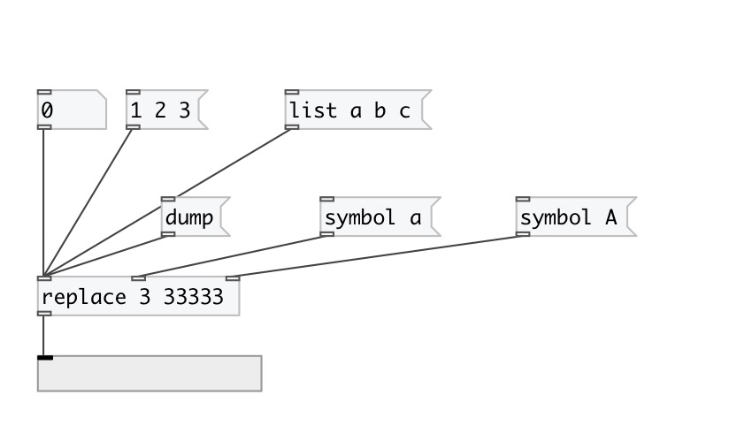

[< reference home](index.html)
---

# replace

Replace atoms in data stream

---

From/to values can be specified both as @from/@to properties or first and second
            arguments.
 

---

---
arguments:

FROM: replace subject 
TO: replace value 

---
properties:

@from: replace subject 
@to: replace value 

---
see also: 

