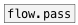

[< reference home](ceammc_lib.html)
---

# replace


Replace atoms in data stream

```


[F]  [1 2 3(  [list a b c(
|    |        |
|    |        |
|    |        |
|    | [dump( | [symbol a( [symbol A(
|    | |      | |          |
|    | |      | |.         |..
[replace 3 33333              ]
|
|
[ui.display @auto_size 0 @size 120 17]

            
```

---
arguments:

FROM: replace subject<br>
TO: replace value<br>

---
properties:

@from: replace subject<br>
@to: replace value<br>

---
see also:<br>
[](flow.pass.html)
