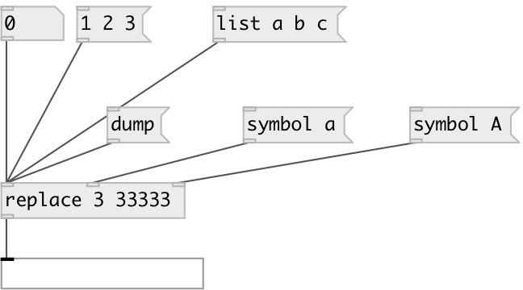

[index](index.html) :: [flow](category_flow.html)
---

# replace
**aliases:** [ceammc/replace]

###### Replace atoms in data stream

*available since version:* 0.1

---

## information
From/to values can be specified both as @from/@to properties or first and second arguments.

## arguments:

* **FROM**
replace subject 
_type:_ atom 

* **TO**
replace value 
_type:_ atom 

## properties:

* **@from** 
Get/set replace subject 
_type:_ atom 
_default:_ None 

* **@to** 
Get/set replace value 
_type:_ atom 
_default:_ None 

## inlets:

* input data stream 
_type:_ control
* @from property inlet 
_type:_ control
* @to property inlet 
_type:_ control

## outlets:

* output data stream 
_type:_ control

## keywords:

[replace](keywords/replace.html)
[test](keywords/test.html)

**See also:**
[\[flow.pass\]](flow.pass.html)

**Authors:** Serge Poltavsky

**License:** GPL3 or later

