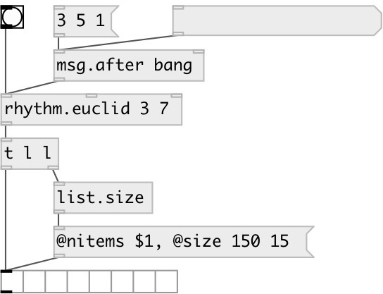

[index](index.html) :: [music](category_music.html)
---

# rhythm.euclid

###### euclid pattern generator

*available since version:* 0.9.7

---

## information
Note: fast Bresenham algorithm is used

## arguments:

* **BEATS**
number of beats inside the sequence 
_type:_ int 

* **N**
the whole sequence length 
_type:_ int 

* **OFFSET**
sequence offset 
_type:_ int 

## properties:

* **@beats** 
Get/set number of beats inside the sequence 
_type:_ int 
_range:_ 0..8192 
_default:_ 3 

* **@n** 
Get/set the whole sequence length 
_type:_ int 
_range:_ 1..8192 
_default:_ 8 

* **@offset** 
Get/set sequence offset 
_type:_ int 
_default:_ 0 

## inlets:

* output generated sequence 
_type:_ control
* set sequence lenghth 
_type:_ control
* set sequence offset 
_type:_ control

## outlets:

* converted value 
_type:_ control

## keywords:

[conv](keywords/conv.html)
[rhythm](keywords/rhythm.html)
[euclid](keywords/euclid.html)
[bresenham](keywords/bresenham.html)

**Authors:** Serge Poltavsky

**License:** GPL3 or later

