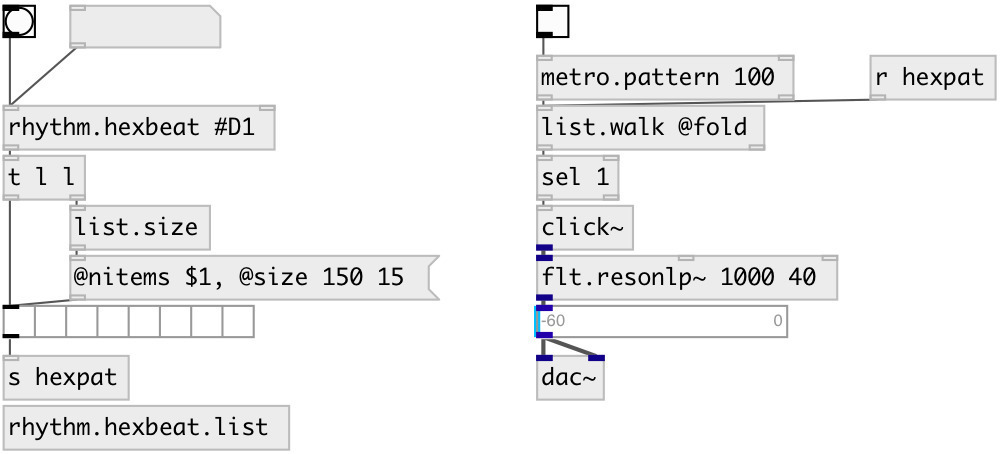

[index](index.html) :: [music](category_music.html)
---

# rhythm.hexbeat

###### hexbeat pattern generator

*available since version:* 0.9.7

---

## arguments:

* **HEX**
init pattern value 
_type:_ symbol 

## properties:

* **@pattern** (readonly)
Get list pattern 
_type:_ list 

* **@hex** 
Get/set hex pattern 
_type:_ symbol 

## inlets:

* output last pattern 
_type:_ control
* set new pattern 
_type:_ control

## outlets:

* list output 
_type:_ control

## keywords:

[conv](keywords/conv.html)
[rhythm](keywords/rhythm.html)
[hexbeat](keywords/hexbeat.html)

**Authors:** Serge Poltavsky

**License:** GPL3 or later

