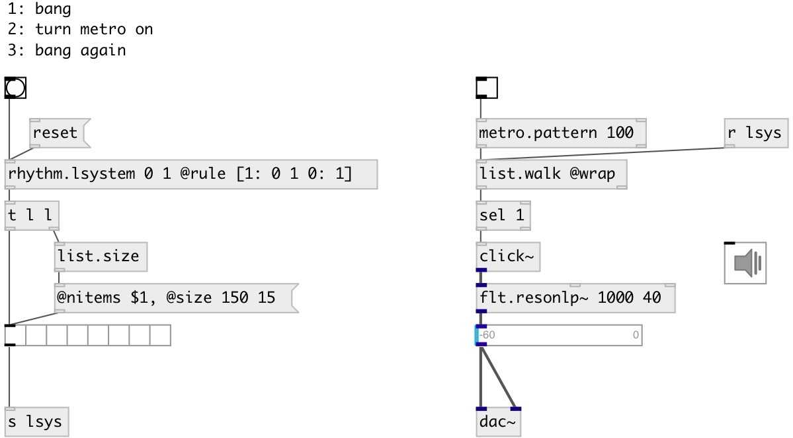

[index](index.html) :: [music](category_music.html)
---

# rhythm.lsystem

###### L-system pattern generator

*available since version:* 0.9.7

---

## arguments:

* **INIT**
init pattern 
_type:_ list 

## methods:

* **reset**
reset to init state 

## properties:

* **@init** 
Get/set init pattern value 
_type:_ list 

* **@value** (readonly)
Get current pattern value 
_type:_ list 

* **@rule** 
Get/set generation rule dict 
_type:_ atom 

* **@max** 
Get/set max generated pattern length 
_type:_ int 
_range:_ 1..32768 
_default:_ 256 

## inlets:

* output last pattern 
_type:_ control

## outlets:

* list output 
_type:_ control

## keywords:

[conv](keywords/conv.html)
[rhythm](keywords/rhythm.html)
[lsystem](keywords/lsystem.html)

**Authors:** Serge Poltavsky

**License:** GPL3 or later

