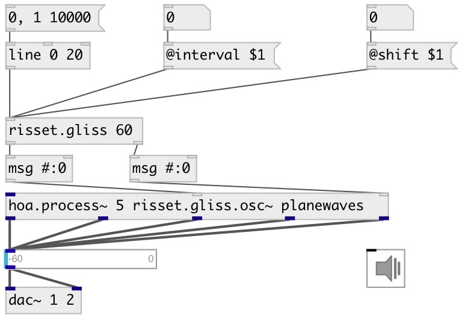

[index](index.html) :: [misc](category_misc.html)
---

# risset.gliss

###### Sheppard/Risset glissando calculator

*available since version:* 0.9.5

---

## arguments:

* **BASE**
base pitch 
_type:_ float 
_units:_ semitone 

## properties:

* **@base** 
Get/set base pitch 
_type:_ float 
_units:_ semitone 
_range:_ 10..100 
_default:_ 60 

* **@n** (initonly)
Get/set number of bands 
_type:_ int 
_default:_ 5 

* **@interval** 
Get/set interval between bands 
_type:_ float 
_units:_ semitone 
_default:_ 12 

* **@shift** 
Get/set band shift in octaves 
_type:_ float 
_default:_ 0 

* **@ampexp** 
Get/set amplitude exponent 
_type:_ float 
_default:_ 2 

## inlets:

* glissando phase 
_type:_ control

## outlets:

* list of midi pitches 
_type:_ control
* list of amplitudes 
_type:_ control

## keywords:

[misc](keywords/misc.html)
[risset](keywords/risset.html)
[glissando](keywords/glissando.html)

**Authors:** Serge Poltavsky

**License:** GPL3 or later

