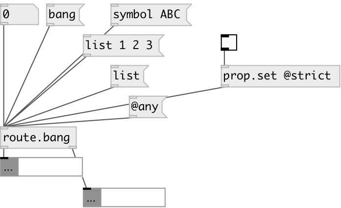

[index](index.html) :: [flow](category_flow.html)
---

# route.bang
**aliases:** [route.b]

###### separate bang messages from other types

*available since version:* 0.9.6

---

## information
to get properties use *prop.get* object, cause all messages (including property requests) are passed thru

## properties:

* **@strict** 
Get/set strict mode. By default empty list treated as bang. Set to true to disable this
behavior 
_type:_ bool 
_default:_ 0 

## inlets:

* any to second outlet 
_type:_ control

## outlets:

* bang output 
_type:_ control
* other messages 
_type:_ control

## keywords:

[route](keywords/route.html)
[bang](keywords/bang.html)

**See also:**
[\[route.float\]](route.float.html)
[\[route.random\]](route.random.html)

**Authors:** Serge Poltavsky

**License:** GPL3 or later

