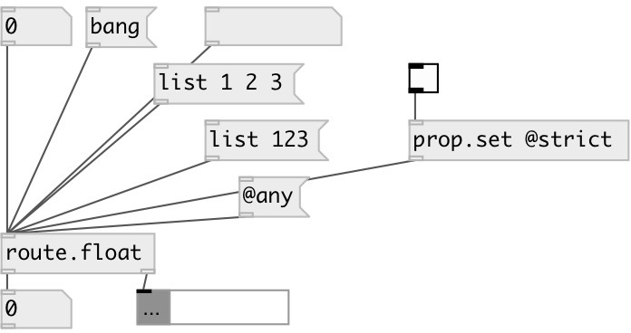

[index](index.html) :: [flow](category_flow.html)
---

# route.float
**aliases:** [route.f]

###### separate float messages from other types

*available since version:* 0.9.2

---

## information
to get properties use *prop.get* object, cause all messages (including property requests) are passed thru

## properties:

* **@strict** 
Get/set strict mode. By default list with single float treated as float. Set to true to
disable this behavior 
_type:_ int 
_enum:_ 0, 1 
_default:_ 0 

## inlets:

* float to first outlet 
_type:_ control

## outlets:

* float output 
_type:_ control
* other messages 
_type:_ control

## keywords:

[route](keywords/route.html)

**Authors:** Serge Poltavsky

**License:** GPL3 or later

