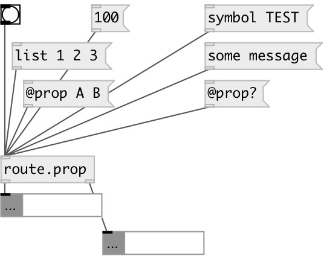

[index](index.html) :: [flow](category_flow.html)
---

# route.prop

###### separate property messages from other types

*available since version:* 0.9.6

---

## inlets:

* property to *first* outlet, any other messages to second outlet 
_type:_ control

## outlets:

* property output 
_type:_ control
* other messages 
_type:_ control

## keywords:

[route](keywords/route.html)

**See also:**
[\[route.float\]](route.float.html)
[\[route.any\]](route.any.html)

**Authors:** Serge Poltavsky

**License:** GPL3 or later

