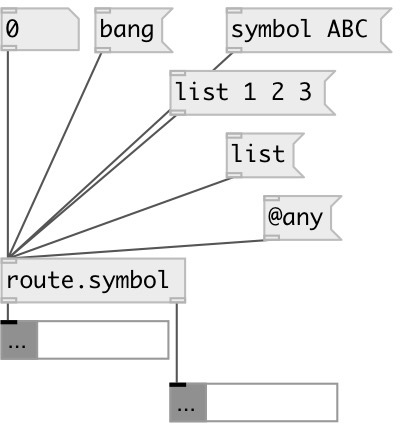

[index](index.html) :: [flow](category_flow.html)
---

# route.symbol
**aliases:** [route.s]

###### separate symbol messages from other types

*available since version:* 0.9.6

---

## inlets:

* any to second outlet 
_type:_ control

## outlets:

* symbol output 
_type:_ control
* other messages 
_type:_ control

## keywords:

[route](keywords/route.html)
[symbol](keywords/symbol.html)

**See also:**
[\[route.float\]](route.float.html)
[\[route.random\]](route.random.html)

**Authors:** Serge Poltavsky

**License:** GPL3 or later

