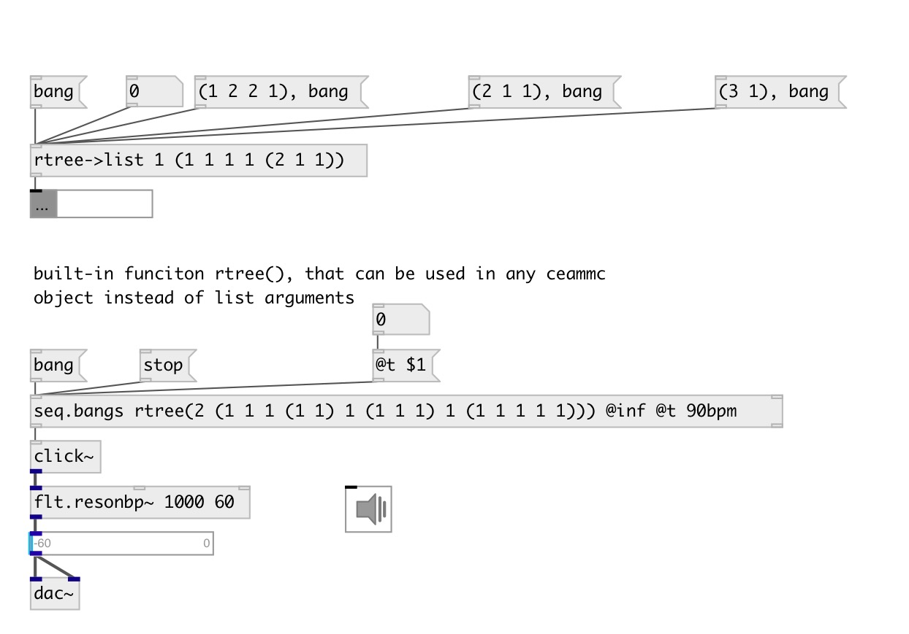

[index](index.html) :: [data](category_data.html)
---

# rtree.to_list
**aliases:** [ceammc/rtree-&gt;list], [rtree-&gt;list]

###### convert OpenMusic-like rhythm tree to list of fractions

*available since version:* 0.9.1

---

## information
rhythm tree is structure to define complex rhythmic patterns Examples: (1 1 1) - triplet, (2 1) - swing

## arguments:

* **DUR**
total pattern duration 
_type:_ float 

* **RTREE**
rhythm tree 
_type:_ atom 

## properties:

* **@dur** 
Get/set total pattern duration 
_type:_ float 
_default:_ 1 

* **@rtree** 
Get/set rhythm tree. (MList) 
_type:_ atom 
_default:_ () 

## inlets:

* output 
_type:_ control

## outlets:

* list output 
_type:_ control

## keywords:

[rhythm](keywords/rhythm.html)
[rtree](keywords/rtree.html)
[openmusic](keywords/openmusic.html)
[pattern](keywords/pattern.html)

**Authors:** Serge Poltavsky

**License:** GPL3 or later

