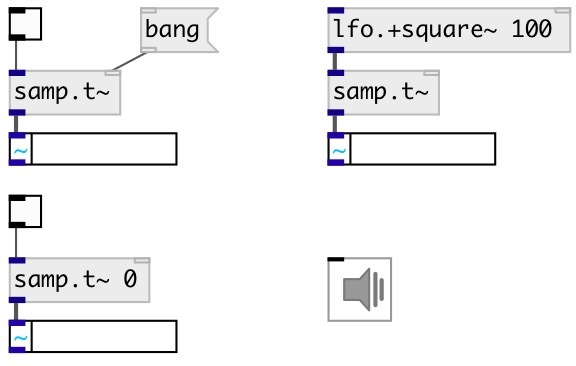

[index](index.html) :: [samp](category_samp.html)
---

# samp.time~

###### sample counter

*available since version:* 0.9.4

---

## arguments:

* **STATE**
initial counter state: on or off 
__type:__ int 

## methods:

* **reset**
reset sample counter to 0 

* **set**
set current value 
  __parameters:__
  - **[VAL=0]** new counter value 
    type: float  

## inlets:

* on 0-&gt;1 change: start counter, on 1-&gt;0 stops. 
__type:__ audio 
* reset sample counter 
__type:__ control 

## outlets:

* current sample number
__type:__ control 

## keywords:

[base](keywords/base.html)

**Authors:** Serge Poltavsky

**License:** GPL3 or later

