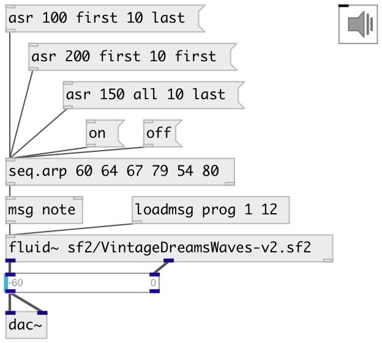

[index](index.html) :: [seq](category_seq.html)
---

# seq.arp

###### sequence arpeggiator

*available since version:* 0.9.1

---

## arguments:

* **CHORD**
list of pitches to arpeggiate 
_type:_ list 

## methods:

* **reset**
reset all notes to off without output 

* **on**
turn on inactive notes 
  __parameters:__
  - **[MODE]** if =first play first inactive note in chord list, if =last play last inactive note in chord list, if =all play all inactive notes 
    type: symbol  

  - **[VEL=127]** note velocity 
    type: float  

  - **[NUM=1]** number of notes to turn on 
    type: int  

* **off**
turn off active notes. 
  __parameters:__
  - **[MODE]** if =first turn off first active note in chord list, if =last turn off last inactive note in chord list, if =all turn off all active notes 
    type: symbol  

  - **[NUM=1]** number of notes to turn on 
    type: int  

* **asr**
set arpeggiate mode and run 
  __parameters:__
  - **STEP** step duration 
    type: float  
    units: ms  
    required: True  

  - **ON_MODE** on mode 
    type: symbol  
    required: True  

  - **HOLD** number of steps to hold value 
    type: int  
    required: True  

  - **OFF_MODE** off mode 
    type: symbol  
    required: True  

## properties:

* **@chord** 
Get/set list of pitches to arpeggiate 
_type:_ list 

## inlets:

* starts sequencer 
_type:_ control

## outlets:

* list: pitch vel 
_type:_ control
* float: number of active notes 
_type:_ control

## keywords:

[seq](keywords/seq.html)
[arpeggio](keywords/arpeggio.html)
[pattern](keywords/pattern.html)

**See also:**
[\[seq.b\]](seq.b.html)
[\[seq.t\]](seq.t.html)

**Authors:** Serge Poltavsky

**License:** GPL3 or later

