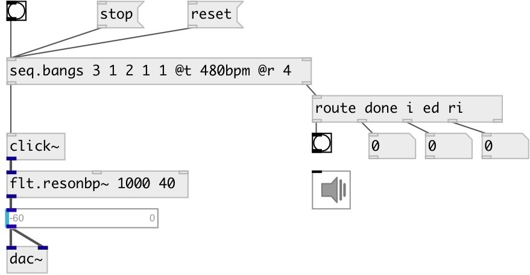

[index](index.html) :: [seq](category_seq.html)
---

# seq.bangs

###### bang sequencer

*available since version:* 0.9.1

---

## arguments:

* **PATTERN**
sequencer pattern in beat duration units 
__type:__ list 

## methods:

* **start**
start sequencer from current position 

* **reset**
reset all counters and stop 

* **rewind**
reset all counters without stopping 

* **stop**
stop sequencer 

* **tick**
output current sequence element and move to next 

## properties:

* **@t** 
Get/set time between beats. Unit values like 100ms or 240bpm also can be used 
__type:__ float 
__units:__ ms 
__range:__ 1..20000 
__default:__ 100 

* **@p** 
Get/set sequencer pattern in beat duration units 
__type:__ list 

* **@r** 
Get/set number of whole sequence repeats. If -1: repeat infinitely 
__type:__ int 
__min value:__ -1 
__default:__ 1 

* **@inf** 
Get/set alias to @r -1, repeats infinitely 
__type:__ alias 

* **@once** 
Get/set alias to @r 1, play once 
__type:__ alias 

* **@dur** 
Get/set whole sequence duration. (Recalculates @t property accordingly) 
__type:__ float 
__units:__ ms 
__min value:__ 0 
__default:__ 0 

* **@i** (readonly)
Get current sequence iteration 
__type:__ int 
__min value:__ 0 
__default:__ 0 

* **@ri** (readonly)
Get current repeat iteration 
__type:__ int 
__min value:__ 0 
__default:__ 0 

* **@mode** 
Get/set sequencer mode. &#39;inc&#39;: from first to last, &#39;dec&#39;: from last to first, &#39;tri&#39;:
from first to last, then back 
__type:__ symbol 
__enum:__ inc, dec, tri 
__default:__ inc 

## inlets:

* reset all counters and start sequencer 
__type:__ control 
* set new pattern value 
__type:__ control 

## outlets:

* bang
__type:__ control 
* [i IDX N( - sequence iteration, [ri IDX N( - repeat iteration, [ed MS( - event
            duration or [done( when done
__type:__ control 

## keywords:

[seq](keywords/seq.html)
[sequencer](keywords/sequencer.html)
[bang](keywords/bang.html)
[pattern](keywords/pattern.html)
[rythm](keywords/rythm.html)

**Authors:** Serge Poltavsky

**License:** GPL3 or later

