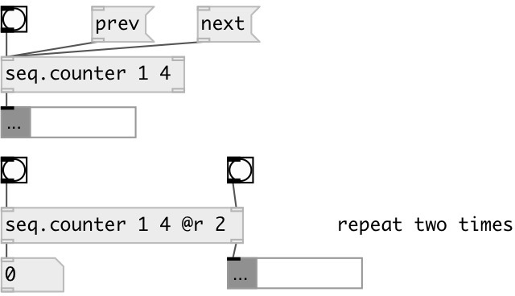

[index](index.html) :: [seq](category_seq.html)
---

# seq.counter

###### sequencer counter

*available since version:* 0.9.1

---

## arguments:

* **FROM**
start value 
_type:_ int 

* **TO**
end value 
_type:_ int 

* **R**
number of repeats 
_type:_ int 

## methods:

* **next**
increment counter then output 

* **prev**
decrement counter then output 

* **reset**
reset counter to start value and repeat counter to 0 

## properties:

* **@from** 
Get/set start value. Setting this property resets @i to 0 
_type:_ int 
_default:_ 0 

* **@to** 
Get/set end value (inclusive) 
_type:_ int 
_default:_ 0 

* **@r** 
Get/set number of repeats. If -1: repeat infinitely. 
_type:_ int 
_min value:_ -1 
_default:_ -1 

* **@inf** 
Get/set alias to @r -1, repeats infinitely 
_type:_ alias 

* **@once** 
Get/set alias to @r 1, play once 
_type:_ alias 

* **@i** 
Get/set current iteration 
_type:_ int 
_default:_ 0 

* **@ri** (readonly)
Get current repeat iteration 
_type:_ int 
_default:_ 0 

* **@mode** 
Get/set repeat counter mode 
_type:_ symbol 
_enum:_ wrap, fold 
_default:_ wrap 

* **@wrap** 
Get/set alias to @mode wrap 
_type:_ alias 

* **@fold** 
Get/set alias to @mode fold 
_type:_ alias 

* **@value** (readonly)
Get current value 
_type:_ int 
_default:_ 0 

## inlets:

* output current value then increment counter 
_type:_ control
* reset counter to start value 
_type:_ control

## outlets:

* int: counter value 
_type:_ control
* int: repeat counter, done: when done 
_type:_ control

## keywords:

[counter](keywords/counter.html)
[modulo](keywords/modulo.html)

**Authors:** Serge Poltavsky

**License:** GPL3 or later

