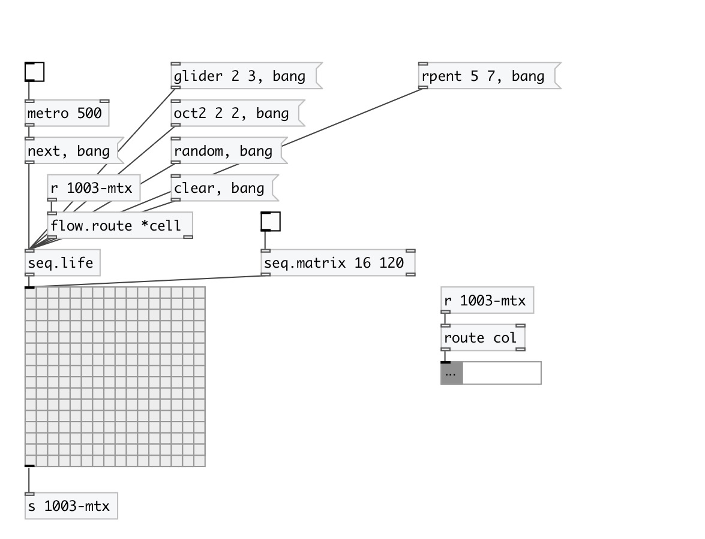

[index](index.html) :: [seq](category_seq.html)
---

# seq.life

###### Conway game of life sequencer

*available since version:* 0.9.2

---

## arguments:

* **ROWS**
number of rows 
_type:_ int 

* **COLS**
number of columns 
_type:_ int 

## methods:

* **blinker**
adds blinker 
  __parameters:__
  - **ROW** row 
    type: int  
    required: True  

  - **COL** column 
    type: int  
    required: True  

* **block**
adds block 
  __parameters:__
  - **ROW** row 
    type: int  
    required: True  

  - **COL** column 
    type: int  
    required: True  

* **cell**
sets cell value 
  __parameters:__
  - **ROW** row 
    type: int  
    required: True  

  - **COL** column 
    type: int  
    required: True  

  - **VALUE** column 
    type: int  
    required: True  

* **clear**
clear all cells 

* **glider**
adds glider 
  __parameters:__
  - **ROW** row 
    type: int  
    required: True  

  - **COL** column 
    type: int  
    required: True  

* **hive**
adds horizontal bee-hive 
  __parameters:__
  - **ROW** row 
    type: int  
    required: True  

  - **COL** column 
    type: int  
    required: True  

* **next**
generate next state 

* **oct2**
adds octagon 
  __parameters:__
  - **ROW** row 
    type: int  
    required: True  

  - **COL** column 
    type: int  
    required: True  

* **random**
fills with random 

* **rpent**
adds R-pentamino 
  __parameters:__
  - **ROW** row 
    type: int  
    required: True  

  - **COL** column 
    type: int  
    required: True  

* **vhive**
adds vertical bee-hive 
  __parameters:__
  - **ROW** row 
    type: int  
    required: True  

  - **COL** column 
    type: int  
    required: True  

## properties:

* **@rows** 
Get/set number of rows 
_type:_ int 
_range:_ 1..32 
_default:_ 16 

* **@cols** 
Get/set number of columns 
_type:_ int 
_range:_ 1..32 
_default:_ 16 

* **@size** (readonly)
Get total cell count 
_type:_ int 
_default:_ 256 

## inlets:

* output all cells 
_type:_ control

## outlets:

* list: pitch vel 
_type:_ control

## keywords:

[seq](keywords/seq.html)
[conway](keywords/conway.html)
[life](keywords/life.html)
[game](keywords/game.html)

**See also:**
[\[seq.b\]](seq.b.html)
[\[seq.t\]](seq.t.html)

**Authors:** Serge Poltavsky

**License:** GPL3 or later

